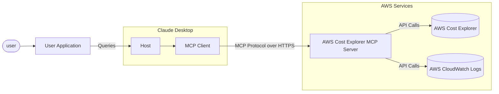

# 🚀 Claude & MCP-Powered AWS Cost Analyzer

> **Agentic AI for cross-account cloud cost observability via Python, AWS, LangChain, Docker, and Claude**


An MCP server for getting AWS spend data via Cost Explorer and Amazon Bedrock usage data via [`Model invocation logs`](https://docs.aws.amazon.com/bedrock/latest/userguide/model-invocation-logging.html) in Amazon Cloud Watch through [Anthropic's MCP (Model Control Protocol)](https://www.anthropic.com/news/model-context-protocol). See section on ["secure" remote MCP server](#secure-remote-mcp-server) to see how you can run your MCP server over HTTPS.



You can run the MCP server locally and access it via the Claude Desktop or you could also run a Remote MCP server on Amazon EC2 and access it via a MCP client built into a LangGraph Agent.

🚨You can also use this MCP server to get AWS spend information from other accounts as long as the IAM role used by the MCP server can assume roles in those other accounts🚨


## Overview

This tool provides a convenient way to analyze and visualize AWS cloud spending data using Anthropic's Claude model as an interactive interface. It functions as an MCP server that exposes AWS Cost Explorer API functionality to Claude Desktop, allowing you to ask questions about your AWS spend in natural language.

## Features

- **Amazon EC2 Spend Analysis**: View detailed breakdowns of EC2 spending for the last day
- **Amazon Bedrock Spend Analysis**: View breakdown by region, users and models over the last 30 days
- **Service Spend Reports**: Analyze spending across all AWS services for the last 30 days
- **Detailed Cost Breakdown**: Get granular cost data by day, region, service, and instance type
- **Interactive Interface**: Use Claude to query your cost data through natural language

## Requirements

- Python 3.12
- AWS credentials with Cost Explorer access
- Anthropic API access (for Claude integration)
- [Optional] Amazon Bedrock access (for LangGraph Agent)
- [Optional] Amazon EC2 for running a remote MCP server

## Installation

1. Install `uv`:
   ```bash
   # On macOS and Linux
   curl -LsSf https://astral.sh/uv/install.sh | sh
   ```
   
   
   ```powershell
   # On Windows
   powershell -ExecutionPolicy ByPass -c "irm https://astral.sh/uv/install.ps1 | iex"
   ```
   Additional installation options are documented [here](https://docs.astral.sh/uv/getting-started/installation/)

2. Clone this repository: (assuming this will be updated to point to aws-samples?)
   ```
   git clone https://github.com/sanxxit/my-aws-cost-explorer.git
   cd aws-cost-explorer-mcp
   ```

3. Set up the Python virtual environment and install dependencies:
   ```
   uv venv --python 3.12 && source .venv/bin/activate && uv pip install --requirement pyproject.toml
   ```
   
4. Configure your AWS credentials:
   ```
   mkdir -p ~/.aws
   # Set up your credentials in ~/.aws/credentials and ~/.aws/config
   ```
   If you useAWS IAM Identity Center, follow the [docs](https://docs.aws.amazon.com/cli/latest/userguide/cli-configure-sso.html) to configure your short-term credentials

## Usage

### Prerequisites

1. Setup [model invocation logs](https://docs.aws.amazon.com/bedrock/latest/userguide/model-invocation-logging.html#setup-cloudwatch-logs-destination) in Amazon CloudWatch.
1. Ensure that the IAM user/role being used has full read-only access to Amazon Cost Explorer and Amazon CloudWatch, this is required for the MCP server to retrieve data from these services.
See [here](https://docs.aws.amazon.com/awsaccountbilling/latest/aboutv2/billing-example-policies.html) and [here](https://docs.aws.amazon.com/aws-managed-policy/latest/reference/CloudWatchLogsReadOnlyAccess.html) for sample policy examples that you can use & modify as per your requirements.
1. To allow your MCP server to access AWS spend information from other accounts set the the `CROSS_ACCOUNT_ROLE_NAME` parameter while starting the server and now you can provide the account AWS account id for another account while interacting with your agent and then agent will pass the account id to the server.

### Local setup

Uses `stdio` as a transport for MCP, both the MCP server and client are running on your local machine.

#### Starting the Server (local)

Run the server using:

```
export MCP_TRANSPORT=stdio
export BEDROCK_LOG_GROUP_NAME=YOUR_BEDROCK_CW_LOG_GROUP_NAME
export CROSS_ACCOUNT_ROLE_NAME=ROLE_NAME_FOR_THE_ROLE_TO_ASSUME_IN_OTHER_ACCOUNTS # can be ignored if you do not want AWS spend info from other accounts
python server.py
```

#### Claude Desktop Configuration

There are two ways to configure this tool with Claude Desktop:

##### Option 1: Using Docker

Add the following to your Claude Desktop configuration file. The file can be found out these paths depending upon you operating system.

- macOS: ~/Library/Application Support/Claude/claude_desktop_config.json.
- Windows: %APPDATA%\Claude\claude_desktop_config.json.
- Linux: ~/.config/Claude/claude_desktop_config.json.

```json
{
  "mcpServers": {
    "aws-cost-explorer": {
      "command": "docker",
      "args": [ "run", "-i", "--rm", "-e", "AWS_ACCESS_KEY_ID", "-e", "AWS_SECRET_ACCESS_KEY", "-e", "AWS_REGION", "-e", "BEDROCK_LOG_GROUP_NAME", "-e", "MCP_TRANSPORT", "-e", "CROSS_ACCOUNT_ROLE_NAME", "aws-cost-explorer-mcp:latest" ],
      "env": {
        "AWS_ACCESS_KEY_ID": "YOUR_ACCESS_KEY_ID",
        "AWS_SECRET_ACCESS_KEY": "YOUR_SECRET_ACCESS_KEY",
        "AWS_REGION": "us-east-1",
        "BEDROCK_LOG_GROUP_NAME": "YOUR_CLOUDWATCH_BEDROCK_MODEL_INVOCATION_LOG_GROUP_NAME",
        "CROSS_ACCOUNT_ROLE_NAME": "ROLE_NAME_FOR_THE_ROLE_TO_ASSUME_IN_OTHER_ACCOUNTS",
        "MCP_TRANSPORT": "stdio"
      }
    }
  }
}
```

> **IMPORTANT**: Replace `YOUR_ACCESS_KEY_ID` and `YOUR_SECRET_ACCESS_KEY` with your actual AWS credentials. Never commit actual credentials to version control.

##### Option 2: Using UV (without Docker)

If you prefer to run the server directly without Docker, you can use UV:

```json
{
  "mcpServers": {
    "aws_cost_explorer": {
      "command": "uv",
      "args": [
          "--directory",
          "/path/to/aws-cost-explorer-mcp-server",
          "run",
          "server.py"
      ],
      "env": {
        "AWS_ACCESS_KEY_ID": "YOUR_ACCESS_KEY_ID",
        "AWS_SECRET_ACCESS_KEY": "YOUR_SECRET_ACCESS_KEY",
        "AWS_REGION": "us-east-1",
        "BEDROCK_LOG_GROUP_NAME": "YOUR_CLOUDWATCH_BEDROCK_MODEL_INVOCATION_LOG_GROUP_NAME",
        "CROSS_ACCOUNT_ROLE_NAME": "ROLE_NAME_FOR_THE_ROLE_TO_ASSUME_IN_OTHER_ACCOUNTS",
        "MCP_TRANSPORT": "stdio"
      }
    }
  }
}
```

Make sure to replace the directory path with the actual path to your repository on your system.

### Remote setup

Uses `sse` as a transport for MCP, the MCP servers on EC2 and the client is running on your local machine. Note that Claude Desktop does not support remote MCP servers at this time (see [this](https://github.com/orgs/modelcontextprotocol/discussions/16) GitHub issue).

#### Starting the Server (remote)

You can start a remote MCP server on Amazon EC2 by following the same instructions as above. Make sure to set the `MCP_TRANSPORT` as `sse` (server side events) as shown below. **Note that the MCP uses JSON-RPC 2.0 as its wire format, therefore the protocol itself does not include authorization and authentication (see [this GitHub issue](https://github.com/modelcontextprotocol/specification/discussions/102)), do not send or receive sensitive data over MCP**.

Run the server using:

```
export MCP_TRANSPORT=sse
export BEDROCK_LOG_GROUP_NAME=YOUR_BEDROCK_CW_LOG_GROUP_NAME
export CROSS_ACCOUNT_ROLE_NAME=ROLE_NAME_FOR_THE_ROLE_TO_ASSUME_IN_OTHER_ACCOUNTS # can be ignored if you do not want AWS spend info from other accounts
python server.py
```

1. The MCP server will start listening on TCP port 8000.
1. Configure an ingress rule in the security group associated with your EC2 instance to allow access to TCP port 8000 from your local machine (where you are running the MCP client/LangGraph based app) to your EC2 instance.

>Also see section on running a ["secure" remote MCP server](#secure-remote-mcp-server) i.e. a server to which your MCP clients can connect over HTTPS.

#### Testing with a CLI MCP client

You can test your remote MCP server with the `mcp_sse_client.py` script. Running this script will print the list of tools available from the MCP server and an output for the `get_bedrock_daily_usage_stats` tool.

```{.bashrc}
# set the hostname for your MCP server
MCP_SERVER_HOSTNAME=YOUR_MCP_SERVER_EC2_HOSTNAME
# or localhost if your MCP server is running locally
# MCP_SERVER_HOSTNAME=localhost 
AWS_ACCOUNT_ID=AWS_ACCOUNT_ID_TO_GET_INFO_ABOUT # if set to empty or if the --aws-account-id switch is not specified then it gets the info about the AWS account MCP server is running in
python mcp_sse_client.py --host $MCP_SERVER_HOSTNAME --aws-account-id $AWS_ACCOUNT_ID
```


#### Testing with Chainlit app

The `app.py` file in this repo provides a Chainlit app (chatbot) which creates a LangGraph agent that uses the [`LangChain MCP Adapter`](https://github.com/langchain-ai/langchain-mcp-adapters) to import the tools provided by the MCP server as tools in a LangGraph Agent. The Agent is then able to use an LLM to respond to user questions and use the tools available to it as needed. Thus if the user asks a question such as "_What was my Bedrock usage like in the last one week?_" then the Agent will use the tools available to it via the remote MCP server to answer that question. We use Claude 3.5 Haiku model available via Amazon Bedrock to power this agent.

Run the Chainlit app using:

```{.bashrc}
chainlit run app.py --port 8080 
```

A browser window should open up on `localhost:8080` and you should be able to use the chatbot to get details about your AWS spend.

### Available Tools

The server exposes the following tools that Claude can use:

1. **`get_ec2_spend_last_day()`**: Retrieves EC2 spending data for the previous day
1. **`get_detailed_breakdown_by_day(days=7)`**: Delivers a comprehensive analysis of costs by region, service, and instance type
1. **`get_bedrock_daily_usage_stats(days=7, region='us-east-1', log_group_name='BedrockModelInvocationLogGroup')`**: Delivers a per-day breakdown of model usage by region and users.
1. **`get_bedrock_hourly_usage_stats(days=7, region='us-east-1', log_group_name='BedrockModelInvocationLogGroup')`**: Delivers a per-day per-hour breakdown of model usage by region and users.

### Example Queries

Once connected to Claude through an MCP-enabled interface, you can ask questions like:

- "Help me understand my Bedrock spend over the last few weeks"
- "What was my EC2 spend yesterday?"
- "Show me my top 5 AWS services by cost for the last month"
- "Analyze my spending by region for the past 14 days"
- "Which instance types are costing me the most money?"
- "Which services had the highest month-over-month cost increase?"

## Docker Support

A Dockerfile is included for containerized deployment:

```
docker build -t aws-cost-explorer-mcp .
docker run -v ~/.aws:/root/.aws aws-cost-explorer-mcp
```

## Development

### Project Structure

- `server.py`: Main server implementation with MCP tools
- `pyproject.toml`: Project dependencies and metadata
- `Dockerfile`: Container definition for deployments

### Adding New Cost Analysis Tools

To extend the functionality:

1. Add new functions to `server.py`
2. Annotate them with `@mcp.tool()`
3. Implement the AWS Cost Explorer API calls
4. Format the results for easy readability

## Secure "remote" MCP server

We can use [`nginx`](https://nginx.org/) as a reverse-proxy so that it can provide an HTTPS endpoint for connecting to the MCP server. Remote MCP clients can connect to `nginx` over HTTPS and then it can proxy traffic internally to `http://localhost:8000`. The following steps describe how to do this.

1. Enable access to TCP port 443 from the IP address of your MCP client (your laptop, or anywhere) in the inbound rules in the security group associated with your EC2 instance.

1. You would need to have an HTTPS certificate and private key to proceed. Let's say you use `your-mcp-server-domain-name.com` as the domain for your MCP server then you will need an SSL cert for `your-mcp-server-domain-name.com` and it will be accessible to MCP clients as `https://your-mcp-server-domain-name.com/sse`. _While you can use a self-signed cert but it would require disabling SSL verification on the MCP client, we DO NOT recommend you do that_. If you are hosting your MCP server on EC2 then you could generate an SSL cert using [no-ip](https://www.noip.com/) or [Let' Encrypt](https://letsencrypt.org/) or other similar services. Place the SSL cert and private key files in `/etc/ssl/certs` and `/etc/ssl/privatekey` folders respectively on your EC2 machine.

1. Install `nginx` on your EC2 machine using the following commands.

    ```{.bashrc}
    sudo apt-get install nginx
    sudo nginx -t
    sudo systemctl reload nginx
    ```

1. Get the hostname for your EC2 instance, this would be needed for configuring the `nginx` reverse proxy.

    ```{.bashrc}
    TOKEN=$(curl -X PUT "http://169.254.169.254/latest/api/token" -H "X-aws-ec2-metadata-token-ttl-seconds: 21600") && curl -H "X-aws-ec2-metadata-token: $TOKEN" -s http://169.254.169.254/latest/meta-data/public-hostname
    ```

1. Copy the following content into a new file `/etc/nginx/conf.d/ec2.conf`. Replace `YOUR_EC2_HOSTNAME`, `/etc/ssl/certs/cert.pem` and `/etc/ssl/privatekey/privkey.pem` with values appropriate for your setup.

   ```{.bashrc}
   server {
    listen 80;
    server_name YOUR_EC2_HOSTNAME;

    # Optional: Redirect HTTP to HTTPS
    return 301 https://$host$request_uri;
    }

    server {
        listen 443 ssl;
        server_name YOUR_EC2_HOSTNAME;

        # Self-signed certificate paths
        ssl_certificate     /etc/ssl/certs/cert.pem;
        ssl_certificate_key /etc/ssl/privatekey/privkey.pem; 

        # Optional: Good practice
        ssl_protocols       TLSv1.2 TLSv1.3;
        ssl_ciphers         HIGH:!aNULL:!MD5;

        location / {
            # Reverse proxy to your local app (e.g., port 8000)
            proxy_pass http://127.0.0.1:8000;
            proxy_http_version 1.1;
            proxy_set_header Host $host;
            proxy_set_header X-Real-IP $remote_addr;
            proxy_set_header X-Forwarded-For $proxy_add_x_forwarded_for;
        }
    }

   ```

1. Restart `nginx`.

    ```{.bashrc}
    sudo systemctl start nginx
    ```

1. Start your MCP server as usual as described in the [remote setup](#remote-setup) section.

1. Your MCP server is now accessible over HTTPS as `https://your-mcp-server-domain-name.com/sse` to your MCP client.

1. On the client side now (say on your laptop or in your Agent) configure your MCP client to communicate to your MCP server as follows.

    ```{.bashrc}
    MCP_SERVER_HOSTNAME=YOUR_MCP_SERVER_DOMAIN_NAME
    AWS_ACCOUNT_ID=AWS_ACCOUNT_ID_TO_GET_INFO_ABOUT # if set to empty or if the --aws-account-id switch is not specified then it gets the info about the AWS account MCP server is running in
    python mcp_sse_client.py --host $MCP_SERVER_HOSTNAME --port 443 --aws-account-id $AWS_ACCOUNT_ID
    ```

    Similarly you could run the chainlit app to talk to remote MCP server over HTTPS.

    ```{.bashrc}
    export MCP_SERVER_URL=YOUR_MCP_SERVER_DOMAIN_NAME
    export MCP_SERVER_PORT=443
    chainlit run app.py --port 8080
    ```

    Similarly you could run the LangGraph Agent to talk to remote MCP server over HTTPS.

    ```{.bashrc}    
    python langgraph_agent_mcp_sse_client.py --host $MCP_SERVER_HOSTNAME --port 443 --aws-account-id $AWS_ACCOUNT_ID
    ```

## License

[MIT License](LICENSE)

## Acknowledgments

- This tool uses Anthropic's MCP framework
- Powered by AWS Cost Explorer API
- Built with [FastMCP](https://github.com/jlowin/fastmcp) for server implementation
- README was generated by providing a text dump of the repo via [GitIngest](https://gitingest.com/) to Claude
